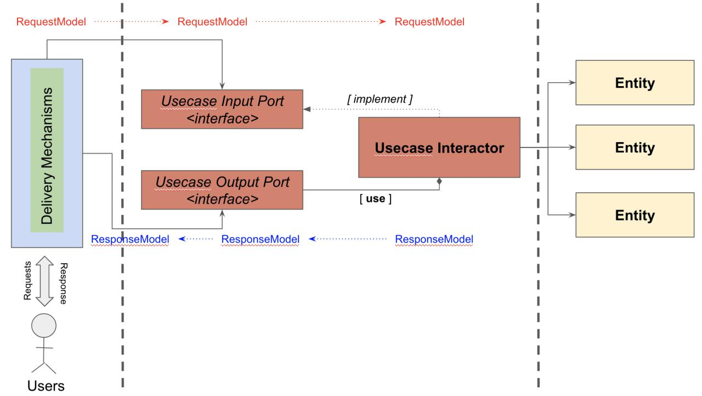

# clean-code-architecture
My personal opinion on how the Clean Code Architecture implementation looks like in `Go` within the context of the `Domain Driven Design` (DDD), yet i adopted some terms from the Onion Architecture such as `domain` in order to avoid any misleading interpretations with the `Entity` in `Domain Driven Design`.

I'm using `in-memory` repository for the current implementation, however... will be adding another sample for other repository implementations such as `database` and `web services`.
The client is also provided as a CLI application at this moment merely to show how this kinda architecture works. Absolutely, will be updating with other infrastructures and adapters such as REST APIs, gRPC services, etc.

Here's what the code architecture looks like in the components level:

## Usage

### Run all Unit Tests

From the terminal, execute this following command:

`go test ./...`

### Test using CLI App

From the terminal, execute this following command:

`go run cmd/cli/main.go`

## Further Read

- https://medium.com/@yauritux/ddd-part-5-b0caf2437912
- https://dev.to/yauritux/clean-code-architecture-in-go-9fj
